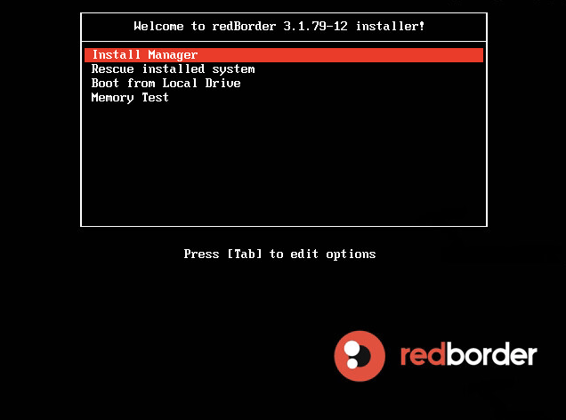
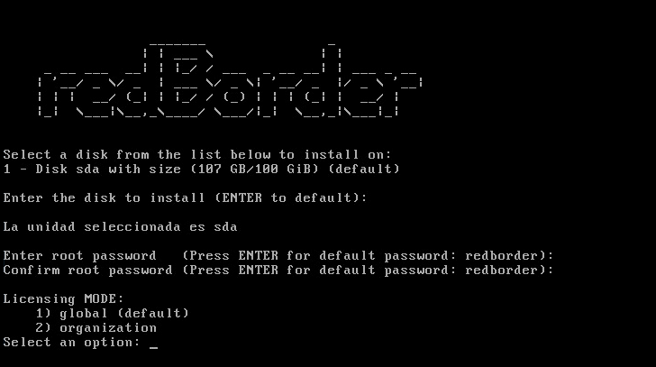
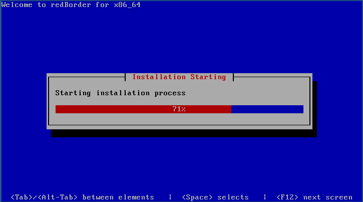
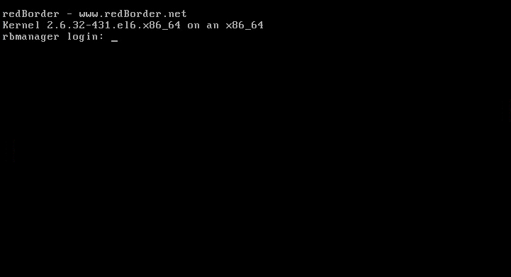
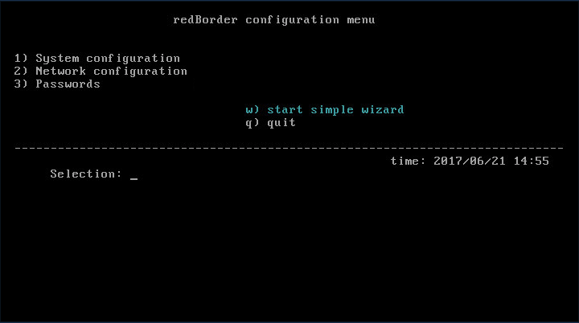
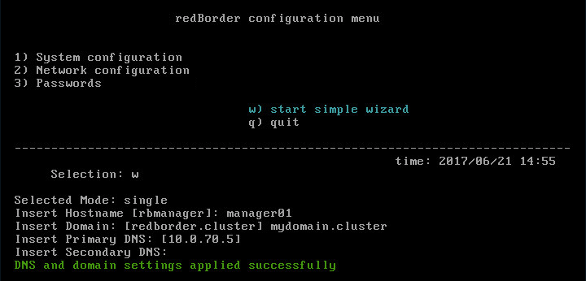
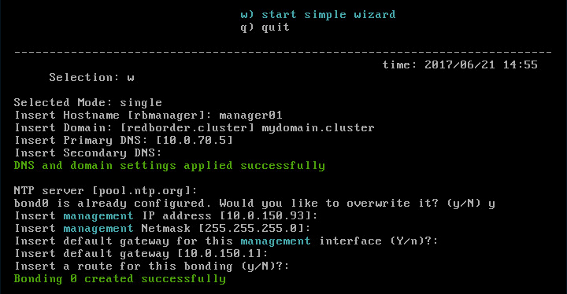
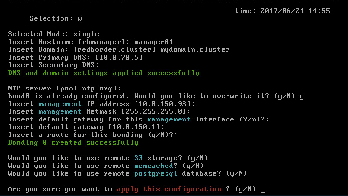

== Capítulo 1: Instalación de la plataforma redborder

En este capítulo se describe el proceso para realizar una instalación de la plataforma redborder. En lo que resta de
la presente documentación nos referiremos a la máquina donde se va a instalar la plataforma como *manager*.

=== Instalación

Para la instalación del manager, el usuario dispondrá de una imagen ISO con la que se deberá arrancar la máquina
en la que se va a instalar.

Al iniciar el asistente de instalación tendrá acceso a un menú tal y como se muestra a continuación:

Seleccionamos "*Install Manager*" para comenzar la instalación.

En pocos segundos nos aparecerá otro menú como el que se muestra a continuación:

En este paso el instalador nos preguntará la unidad de disco en la que deseamos realizar la instalación.

[NOTE]
===============================
La unidad seleccionada será formateada por el instalador
===============================

También en este menú se nos preguntará por la contraseña que deseamos configurar para el usuario "root" del sistema.

IMPORTANT: Por defecto la contraseña de root es "*redborder*"

Por último, se pedirá si el licenciamiento de los sensores que va a incorporar a la plataforma se hará de manera global o por organización.
La opción global es la que deberá escoger si lo que quiere es que las licencias valgan para todos los sensores. Si va a crear organizaciones
cuya gestión sea independiente una de otra, entonces escoja por organización.

Tras esto se procederá a la instalación de los paquetes de instalación del software en el disco duro.

Espere hasta que la instalación se haya completado al 100%.

Una vez finalizada la instalación, el sistema será reiniciado. Durante el primer arranque el sistema procederá
a realizar una serie de acciones para configurarse por primera vez.

[NOTE]
===============================
Estos procesos pueden tardar varios minutos
===============================

Una vez que en la terminal nos aparezca la siguiente imagen, ya podremos acceder.

IMPORTANT: Las credenciales por defecto son "usuario: root / password: redborder"

=== Configuración inicial - Modo automático

Si la máquina sobre la que se está instalando la plataforma tiene al menos 2 interfaces de red, cada una conectada a una red diferente con obtención de
direccionamiento de red automático por DHCP, entonces el manager se configurará de manera automática y autónoma. La primera interfaz detectada por el sistema
se configurará como `bond0`, la cual es denominada interfaz de gestión, y la siguiente `bond1`, denominada interfaz de sincronismo.

El primer manager instalado, al no encontrar otros en la red de sincronismo, se autoconfigurará como master. Los siguientes, al encontrar un master en la red
de sincronismo en el proceso de escaneo y verificación, se autoconfigurarán en modo custom (más tarde se le puede activar los servicios que deseemos).

Éste es el modo más sencillo y rápido de instalar un cluster de la plataforma redborder.

=== Configuración inicial - Wizard

Si la red no está preparada para la configuración automática por DHCP o se dispone tan sólo de una interfaz de red o un direccionamiento asignado al cluster, se puede proceder
a su instalación mediante el wizard.

Una vez logueados en el manager, debemos ejecutar el comando *rb_sysconf* para realizar la configuración inicial.

Estas son las opciones que encontrará en la pantalla principal de este menú:

. *System Configuration*: configuración del hostname, IP del Manager, hora y estado del Manager.
. *Network Configuration*: creación de bondings, segmentos, DNS, rutas e IPMI. Para formar un cluster se necesitan al menos dos interfaces de red, una para gestión y otra para comunicación entre los nodos del cluster. Para instalaciones de un solo nodo, solo es necesaria una interfaz de red para la gestión.
. *Passwords*: acceda a esta opción si desea modificar las contraseñas de los usuarios del sistema.
. *w) start simple wizard*: inicia un asistente que le permitirá de forma sencilla y rápida realizar la instalación y configuración del Manager.
. *q) quit*: Salir. Nos devuelve a la pantalla principal de configuración del sistema.

Para realizar la instalación automática del manager, usaremos la opción *w) start simple wizard*.

Existen una serie de opciones definidas por defecto (indicadas entre corchetes).
Para aceptarlas tan sólo tiene que pulsar *Enter*. No obstante, puede modificarlas manualmente
en cualquier momento del proceso de instalación.

*Mode, Hostname, DNS y NTP*

. Insert Hostname [rbmanager]. La opción que viene definida por defecto es la de rbmanager. Este es un nombre que identifica de manera clara y sencilla al Manager y su posición dentro del cluster.
. Insert domain: [redborder.cluster]. Dominio definido por defecto.
. Insert DNS Primary. Definido por defecto. El usuario podrá cambiarlo para indicar el servidor que provee DNS a su red y al que estará asociado el Manager.
. Insert DNS Secondary (optional). Indicar DNS secundario de manera opcional.

IMPORTANT: Es necesario que se utilicen diferentes nombres para cada uno de los Managers que se van a unir al cluster.

Una vez introducidos estos valores, el sistema le avisará de que los cambios han sido aplicados con éxito mediante el siguiente
mensaje rotulado en verde: DNS and domain settings applied successfully.

*Configuración de NTP y red de gestión*

El siguiente paso es indicar el servidor de hora: *NTP server [pool.ntp.org]:*
Si existe algún servidor NTP en su red que quiera utilizar, se debe indicar aquí. En caso contrario, se asignará uno por defecto.

Si sólo va a desplegar un manager, necesitará una única interfaz de red. Por el contrario, si va a desplegar un cluster
con múltiples managers será necesario al menos reservar 2 interfaces de red:

* Una para la red de gestión (Management IP address)
* Otra para la red de sincronismo (Sync IP address)

En cada una de estas interfaces se configurará un bonding de red.

La configuración del bonding de gestión solicitará los siguientes datos:

* Insert management IP address:
* Insert management Netmask
* Insert default gateway for this management interface (Y/n)
* Insert a route for this bonding (y/N)?: Opción para insertar una ruta estática.

Una vez introducidos estos valores, el sistema le avisará de que el bonding ha sido creado con éxito.

*Configuración de red de sincronismo*

Si hemos configurado la máquina con 2 interfaces de red, a continuación tendremos que configurar el bonding para
la red de sincronismo de la misma forma que con la de gestión.

[NOTE]
===============================
Esta parte no aparecerá si sólo hemos configurado una interfaz de red en la máquina
===============================

*Configuración de cluster y servicios externos*

Como último paso se preguntan una serie de opciones de configuración relacionadas con la creación de un cluster de varios managers y la configuración de servicios fuera del manager. Para instalaciones on-premises, se recomienda dejar los valores por defecto.

Una vez finalizado, aceptamos y se iniciará el proceso de configuración.

[NOTE]
===============================
Este proceso puede tardar varios minutos
===============================

*Primera conexión a la aplicación web*

Una vez se haya instalado y configurado el software, se podrá acceder a la aplicación web conectando mediante un navegador a la URL `https://IP-de-gestion` usando como usuario y password por defecto `admin` (usuario) y `redborder` (password). Para la conexión por consola, se puede hacer por consola directa (tty) o remota (ssh) usando el usuario root y el password suministrado durante el proceso de instalación, que por defecto es `redborder`.
